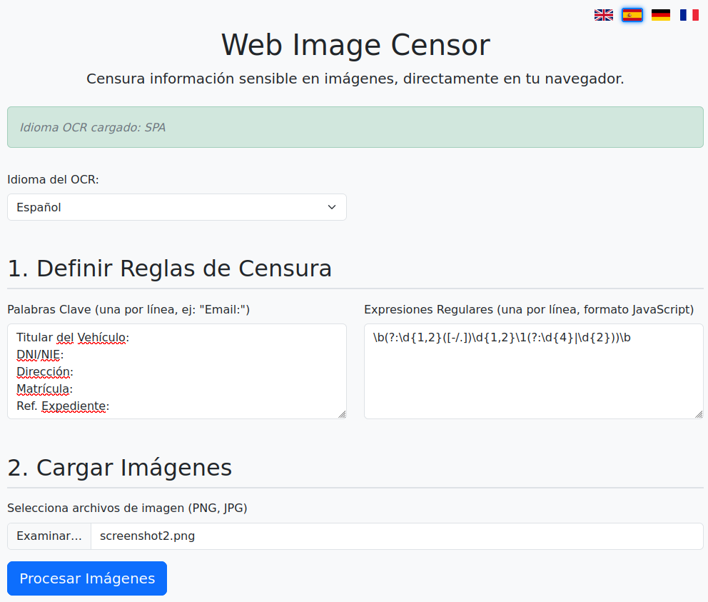
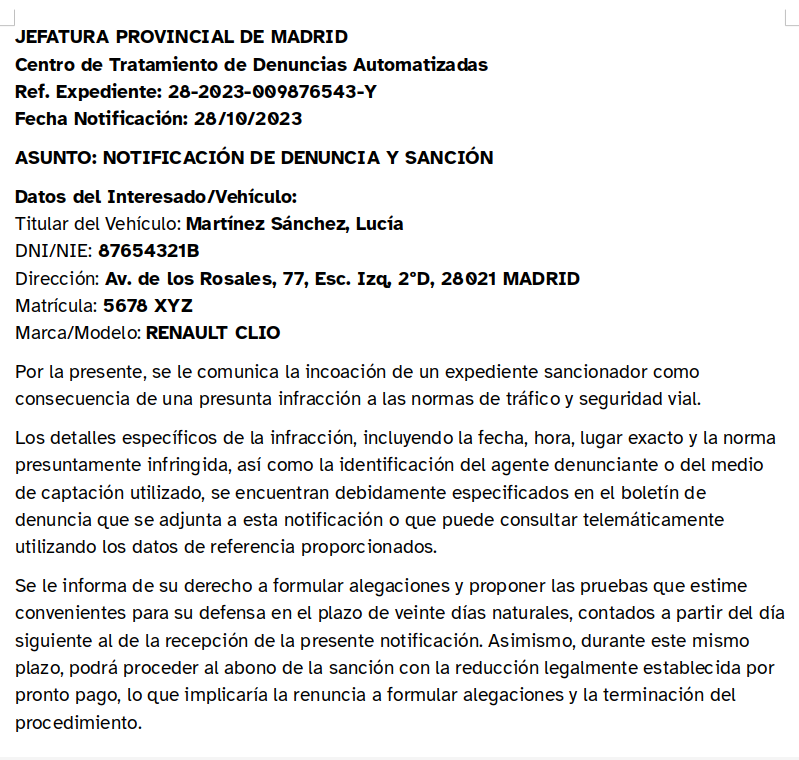
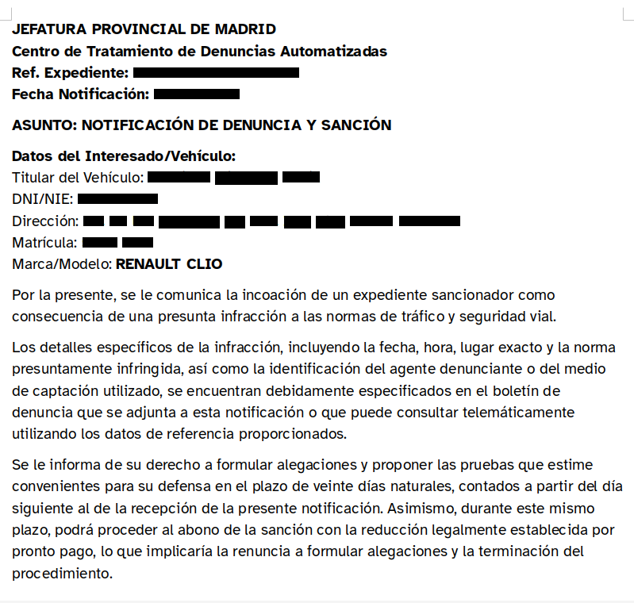

# Web Image Censor: Censura de Texto en Imágenes en el Navegador

**Web Image Censor** es una aplicación web autocontenida que te permite censurar información sensible en imágenes directamente en tu navegador. Utiliza Tesseract.js para el Reconocimiento Óptico de Caracteres (OCR) y te permite definir reglas mediante palabras clave y expresiones regulares para ocultar automáticamente el texto detectado.

Es especialmente útil si necesitas subir documentos escaneados o capturas de pantalla a servicios de terceros (como modelos de Inteligencia Artificial, almacenamiento en la nube, etc.) y quieres asegurar la privacidad eliminando datos personales o confidenciales antes de hacerlo. ¡Todo el procesamiento se realiza localmente en tu navegador, sin que tus imágenes salgan de tu equipo!

## 🖼️ Capturas de Pantalla

<table>
  <tr>
    <td align="center" style="padding:10px;">
      <strong>1. Interfaz Principal de la Aplicación:</strong> 
      <em>Aquí se muestra la vista general de Web Image Censor, donde se definen las reglas, se cargan imágenes y se ven los resultados.</em>  
      
    </td>
  </tr>
</table>

 

A continuación se muestra un ejemplo de una imagen original y su versión censurada:

 

<table>
  <tr>
    <td align="center" style="width:50%; padding:10px; vertical-align: top;">
      <strong>Imagen original</strong>  
      
    </td>
    <td align="center" style="width:50%; padding:10px; vertical-align: top;">
      <strong>Imagen censurada</strong>  
      
    </td>
  </tr>
</table>

## ✨ Características Principales

*   💻 **Procesamiento Local:** Todo el OCR y la censura ocurren en tu navegador. Tus imágenes nunca se envían a un servidor. ¡Máxima privacidad!
*   🌍 **Múltiples Idiomas OCR:** Soporte para inglés, español, alemán y francés (ampliable).
*   🌐 **Interfaz Multilingüe:** La interfaz de usuario también está disponible en varios idiomas para tu comodidad.
*   🔧 **Reglas de Censura Flexibles:**
    *   🔑 **Palabras Clave:** Define palabras clave (ej. "Nombre:", "Email:") y la aplicación censurará el texto que les sigue en la misma línea.
    *   💡 **Expresiones Regulares:** Usa la potencia de las expresiones regulares (formato JavaScript) para identificar patrones complejos de texto a censurar (emails, DNIs, teléfonos, etc.).
*   🔂 **Procesamiento por Lotes:** Sube y procesa múltiples imágenes a la vez, ahorrando tiempo.
*   🖼️ **Vista Previa Instantánea:** Visualiza la imagen censurada y el texto OCR detectado (para depuración) antes de descargar.
*   💾 **Descarga Individual o en ZIP:** Descarga las imágenes procesadas una por una o todas juntas en un práctico archivo .zip.
*   🔌 **Funcionamiento Autónomo Tras Carga Inicial:** Aunque las librerías principales (como Tesseract.js) y los datos de idioma del OCR se cargan inicialmente desde CDNs (requiriendo conexión), una vez que todo está cargado en tu navegador, la aplicación puede funcionar offline para el procesamiento de imágenes. El procesamiento en sí es 100% local.

## 🚀 Pruébalo Ahora

Puedes probar **Web Image Censor** directamente desde GitHub Pages:
[**https://Soyunomas.github.io/web-censure-text/censuretext.html**](https://Soyunomas.github.io/web-censure-text/censuretext.html)

*(Nota: La primera vez que selecciones un idioma OCR diferente al inicial, puede tardar un poco en descargar los datos del idioma correspondiente).*

## ⚙️ Cómo Usarlo

Usar **Web Image Censor** es sencillo e intuitivo. Sigue estos pasos:

1.  **Accede a la Aplicación:**
    *   Abre el enlace: [**https://Soyunomas.github.io/web-censure-text/censuretext.html**](https://Soyunomas.github.io/web-censure-text/censuretext.html)

2.  **Configuración Inicial (Opcional pero recomendado):**
    *   **Idioma de la Interfaz:** Selecciona tu idioma preferido para la interfaz de usuario haciendo clic en una de las banderas en la esquina superior derecha.
    *   **Idioma del OCR:** Ve a la sección "Ajustes" (que aparece tras la inicialización del OCR) y elige el idioma principal del texto en tus imágenes desde el desplegable "Idioma del OCR". Esto es crucial para una detección precisa. La primera vez que selecciones un idioma, puede tardar unos segundos en cargarse.

3.  **Define las Reglas de Censura:**
    *   **Palabras Clave:** En el área de texto "Palabras Clave", introduce una por línea las palabras o frases clave que preceden a la información que quieres censurar (ej. `Nombre:`, `Dirección:`, `Email:`). La aplicación **censurará el texto que sigue a estas palabras en la misma línea**.
    *   **Expresiones Regulares:** En el área de texto "Expresiones Regulares", introduce una por línea las expresiones regulares (formato JavaScript) para patrones más complejos (ej. correos electrónicos, DNIs, números de teléfono). Consulta la tabla de ejemplos más abajo para ideas.

4.  **Carga las Imágenes:**
    *   Haz clic en "Seleccionar archivos" o arrastra y suelta tus imágenes (formatos PNG o JPG) en el área designada.
    *   Verás un mensaje indicando cuántos archivos se han seleccionado.

5.  **Procesa las Imágenes:**
    *   Una vez que hayas definido tus reglas y cargado tus imágenes, el botón "Procesar Imágenes" se habilitará. Haz clic en él.
    *   La aplicación procesará cada imagen, aplicando el OCR y las reglas de censura. Verás el progreso debajo del botón.

6.  **Revisa los Resultados:**
    *   Las miniaturas de las imágenes procesadas aparecerán en la sección "Resultados".
    *   Haz clic en cualquier miniatura para abrir una **vista previa** más grande en una ventana modal.
    *   En la ventana modal, también puedes:
        *   Ver el texto OCR detectado (útil para depuración o para refinar tus reglas) activando "Mostrar/Ocultar Texto OCR Detectado (Depuración)".
        *   Descargar la imagen individualmente haciendo clic en "Descargar Imagen".

## 📥 Descarga de Resultados

Una vez que tus imágenes han sido procesadas, tienes estas opciones para descargarlas:

*   **Descarga Individual:**
    1.  Como se mencionó arriba, en la galería de "Resultados", haz clic en la miniatura de la imagen.
    2.  En la ventana modal de vista previa, haz clic en el botón **"Descargar Imagen"**. La imagen se guardará con el prefijo `censored_` seguido del nombre original del archivo.

*   **Descarga Múltiple (ZIP):**
    1.  Después de procesar al menos una imagen, el botón **"Descargar Todo (.zip)"** debajo de la galería de resultados se habilitará.
    2.  Haz clic en este botón para descargar un archivo ZIP que contendrá todas las imágenes procesadas en la sesión actual. Cada imagen dentro del ZIP también tendrá el prefijo `censored_`.

---

## 💡 Ejemplos de Expresiones Regulares Útiles

Aquí tienes una tabla con ejemplos de expresiones regulares que puedes usar en **Web Image Censor** para censurar información común en documentos. Recuerda que deben estar en formato JavaScript (sin delimitadores `/regex/flags` en el textarea, solo el patrón).

| # | Dato a Censurar                      | Expresión Regular (Formato JavaScript)                                 | Ejemplo de Texto que Coincidiría     | Descripción Breve                                                                               |
| - | :----------------------------------- | :--------------------------------------------------------------------- | :----------------------------------- | :---------------------------------------------------------------------------------------------- |
| 1 | **Correos Electrónicos**             | `[a-zA-Z0-9._%+-]+@[a-zA-Z0-9.-]+\.[a-zA-Z]{2,}`                       | `info@dominio.com`                   | Direcciones de email estándar.                                                                  |
| 2 | **Números de Teléfono (Genérico Int.)** | `\+?\d{1,3}?[- .]?\(?\d{1,4}\)?[- .]?\d{1,4}[- .]?\d{1,4}[- .]?\d{1,9}` | `+1 (555) 123-4567`, `+44 2079460958` | Formato flexible para teléfonos internacionales (prefijo, espacios, guiones, paréntesis).          |
| 3 | **DNI (España)**                     | `\d{8}[A-ZTRWAGMYFPDXBNJZSQVHLCKE]`                                     | `12345678Z`                          | DNI español (8 números y una letra específica).                                                  |
| 4 | **Números Tarjeta Crédito (Genérico)** | `\d{4}[- ]?\d{4}[- ]?\d{4}[- ]?\d{4}`                                   | `1234-5678-9012-3456`, `4444555566667777` | Números de tarjeta de 16 dígitos (VISA, MC), con o sin espacios/guiones. (No valida todos los tipos). |
| 5 | **Códigos Postales (USA - ZIP)**     | `\d{5}(-\d{4})?`                                                        | `90210`, `10001-1234`                | Códigos postales de EE.UU. (5 dígitos o ZIP+4).                                                 |
| 6 | **Fechas (Formato ISO YYYY-MM-DD)**  | `\d{4}-(0[1-9]|1[0-2])-(0[1-9]|[12]\d|3[01])`                            | `2023-12-25`                         | Fechas en formato estándar ISO.                                                                 |
| 7 | **Direcciones IP (IPv4)**            | `(?:[0-9]{1,3}\.){3}[0-9]{1,3}`                                         | `192.168.1.1`                        | Direcciones IPv4. (No valida rangos >255).                                                      |
| 8 | **URLs (Básicas)**                   | `https?:\/\/(?:www\.)?[-\w@:%.+~#=]{1,256}\.[a-zA-Z0-9()]{1,6}\b[-\w@:%+.~#?&/=]*` | `http://ejemplo.com/pagina`          | URLs que comienzan con `http://` o `https://`.                                                 |
| 9 | **IBAN (Genérico - Sin validación país)** | `[A-Z]{2}\d{2}[A-Z0-9]{11,30}`                                       | `DE89370400440532013000`             | IBAN genérico (2 letras país, 2 dígitos control, hasta 30 alfanuméricos).                       |
| 10| **Cantidades Monetarias (€, $, £)**  | `[$€£]\s?\d+(?:[.,]\d{2,3})*(?:[.,]\d{2})?|\d+(?:[.,]\d{2,3})*(?:[.,]\d{2})?\s?[$€£]` | `€1,234.56`, `$500.00`, `100 £`      | Cantidades con símbolo de moneda (€, $, £) antes o después.                                    |
| 11| **Códigos SWIFT/BIC**                | `[A-Z]{4}[A-Z]{2}[A-Z0-9]{2}(?:[A-Z0-9]{3})?`                           | `NWBKGB2L`, `DEUTDEFFXXX`            | Código de identificación bancaria (8 u 11 caracteres).                                          |
| 12| **Horas (HH:MM o HH:MM:SS)**         | `([01]\d|2[0-3]):([0-5]\d)(:([0-5]\d))?`                                 | `14:30`, `09:15:45`                  | Horas en formato 24h, con o sin segundos.                                                       |
| 13| **Nombres de Usuario (Genérico)**     | `@[\w.-]+`                                                             | `@usuario123`, `@nombre.apellido`    | Nombres de usuario comunes precedidos por `@`.                                                  |
| 14| **Números de Serie (Alfanumérico)**  | `[A-Z0-9-]{8,20}`                                                      | `SN-ABC123XYZ789`                    | Cadenas alfanuméricas con guiones (longitud 8-20) para IDs, números de serie.                 |
| 15| **Números de Identificación Fiscal (VAT ID - Genérico UE)** | `(ATU\d{8}|BE\d{10}|BG\d{9,10}|CY\d{8}[A-Z]|CZ\d{8,10}|DE\d{9}|DK\d{8}|EE\d{9}|EL\d{9}|ES[A-Z0-9]\d{7}[A-Z0-9]|FI\d{8}|FR[A-Z0-9]{2}\d{9}|HR\d{11}|HU\d{8}|IE\d{7}[A-Z]{1,2}|IT\d{11}|LT\d{9,12}|LU\d{8}|LV\d{11}|MT\d{8}|NL\d{9}B\d{2}|PL\d{10}|PT\d{9}|RO\d{2,10}|SE\d{12}|SI\d{8}|SK\d{10})` | `DE123456789`, `ESX1234567A`         | Detecta varios formatos de NIF/VAT ID de países de la UE. (Expresión larga, puede ser lenta). |

**Nota:** Estas expresiones regulares son ejemplos. Su efectividad puede variar según la calidad del OCR y la complejidad del documento. Siempre es buena idea probarlas con tus imágenes específicas.

## 🛠️ Tecnologías Usadas

*   **HTML5, CSS3, JavaScript (ES6+)**
*   **Tesseract.js (v5):** Para el Reconocimiento Óptico de Caracteres (OCR) en el navegador.
*   **Bootstrap 5:** Para el diseño y componentes de la interfaz de usuario.
*   **JSZip:** Para comprimir las imágenes descargadas en un archivo .zip.
*   **FileSaver.js:** Para facilitar la descarga de archivos en el navegador.

## 🚀 Motivación

La necesidad de compartir información visual (documentos, capturas) con herramientas de IA o almacenarlas en la nube es cada vez más común. Sin embargo, estos documentos a menudo contienen datos sensibles. **Web Image Censor** nace para ofrecer una solución sencilla y centrada en la privacidad, permitiendo a los usuarios controlar qué información se comparte. Al realizar todo el procesamiento en el cliente, se garantiza que los datos originales nunca abandonan el dispositivo del usuario.

## 📜 Licencia

Este proyecto está bajo la Licencia MIT. Ver el archivo [LICENSE](LICENSE) para más detalles. (Si el archivo `LICENSE` no existe en tu repositorio, asegúrate de añadir uno con el texto de la licencia MIT).

---

Creado con ❤️ por [Soyunomas](https://github.com/Soyunomas)
